# is-whisper


Icelandic speech-to-text using a post-trained Whisper model.

## Setup

Requires **Python 3.12**. The `ctranslate2` engine (used by faster-whisper) ships pre-built binaries for this version.

```bash
pyenv install 3.12
pyenv local 3.12

python3 -m venv venv
source venv/bin/activate
pip install -r requirements.txt
```

If you get `blake2b` hash errors, Homebrew updated OpenSSL after your Python was compiled. Fix it by recompiling:

```bash
pyenv install 3.12 --force
rm -rf venv
python3 -m venv venv
source venv/bin/activate
pip install -r requirements.txt
```

The model (~3GB) downloads automatically on first run.

For Gemini correction (`--llm`), get an API key from https://aistudio.google.com/ and either:

```bash
export GEMINI_API_KEY="your-api-key"
# or
echo "your-api-key" > .gemini_key
```

## Try it

A sample audio file is included (from [Mozilla Common Voice](https://commonvoice.mozilla.org/is) — Icelandic) so you can try it right away. The clip says: *"Landnámsmaður í Krossavík var Lýtingur Arnbjarnarson."*

```bash
python transcribe.py audio/sample.m4a
```

Raw output — no punctuation, no capitalization, and the first syllable gets clipped:
```
námsmaður í krossavík var lýtingur arnbjarnarson
```

Now add `--llm` and Gemini fixes all of that:
```bash
python transcribe.py audio/sample.m4a --llm
```
```
Landnámsmaður í Krossavík var Lýtingur Arnbjarnarson.
```

The reference transcript is in `audio/sample_transcript.txt`.

Or record your own — open **Voice Memos** on your Mac, say something in Icelandic, drag the recording into `audio/`, and run:

```bash
python transcribe.py audio/your-recording.m4a --llm
```

That's it. Your spoken Icelandic comes back as clean, punctuated text. No account needed, no cloud service, everything runs on your machine.

## How it works

```mermaid
flowchart LR
    A["🎙️ Audio"] --> B["Whisper\n(local, CPU)"]
    B --> C["námsmaður í krossavík\nvar lýtingur arnbjarnarson"]
    C -->|--llm| D["Gemini"]
    D --> E["Landnámsmaður í Krossavík\nvar Lýtingur Arnbjarnarson."]

    style C fill:#fee,stroke:#c33,color:#333
    style E fill:#efe,stroke:#3a3,color:#333
```



## Why

There aren't many good open source options for Icelandic speech-to-text. The [whisper-large-icelandic](https://huggingface.co/language-and-voice-lab/whisper-large-icelandic-62640-steps-967h-ct2) model from Language and Voice Lab is post-trained on 967 hours of Icelandic speech and runs locally via [faster-whisper](https://github.com/SYSTRAN/faster-whisper).

It's not great — accuracy is rough and it outputs raw text with no punctuation or capitalization. But it's the best we found for Icelandic without paying for a cloud API.

To compensate, we added an optional Google Gemini step (`--llm`) that takes the raw output and fixes punctuation, capitalization, and grammar. It can even recover missing words from context — like restoring "landnámsmaður" from "námsmaður" — on top of adding proper capitalization and punctuation.

## Usage

```
python transcribe.py <audio_file> [mode] [options]
```

### Arguments

| Argument | Description |
|----------|-------------|
| `audio_file` | Path to audio file (M4A, MP3, WAV, FLAC, OGG) |

### Modes

| Mode | beam_size | Description |
|------|-----------|-------------|
| `fast` | 1 | Fastest, less accurate |
| `balanced` | 5 | Default |
| `accurate` | 10 | Slowest, best quality |

### Options

| Flag | Description |
|------|-------------|
| `--llm`, `-l` | Fix punctuation/grammar with Google Gemini |
| `--save`, `-s` | Save output to `transcripts/` directory |
| `--verbose`, `-v` | Show timestamps, timing, and progress |

### Output

By default, the transcribed text is printed to stdout. With `--save`, files are written to `transcripts/`:

| File | Content |
|------|---------|
| `<name>_transcript.txt` | Plain text |
| `<name>_transcript.json` | Text with timestamps and metadata |
| `<name>_corrected.txt` | Punctuation-fixed text (only with `--llm`) |

## Examples

### Default — just the text

```bash
$ python transcribe.py audio/sample.m4a
námsmaður í krossavík var lýtingur arnbjarnarson
```

### With Gemini correction

```bash
$ python transcribe.py audio/sample.m4a --llm
Landnámsmaður í Krossavík var Lýtingur Arnbjarnarson.
```

### Verbose mode

```bash
$ python transcribe.py audio/sample.m4a --llm -v
Landnámsmaður í Krossavík var Lýtingur Arnbjarnarson.
```

stderr shows progress:

```
Loading model...
Transcribing: audio/sample.m4a
  0.11s -> 0.61s  námsmaður í krossavík var lýtingur arnbjarnarson
Duration: 5.0s | Time: 15.2s
Fixing punctuation with Gemini...
Corrected (95% confidence): Bætti við greinarmerki og lagaði hástafi.
```

### Save to files

```bash
$ python transcribe.py audio/sample.m4a --llm --save
Landnámsmaður í Krossavík var Lýtingur Arnbjarnarson.
```

```
Saved: transcripts/sample_transcript.txt
Saved: transcripts/sample_transcript.json
Saved: transcripts/sample_corrected.txt
```
